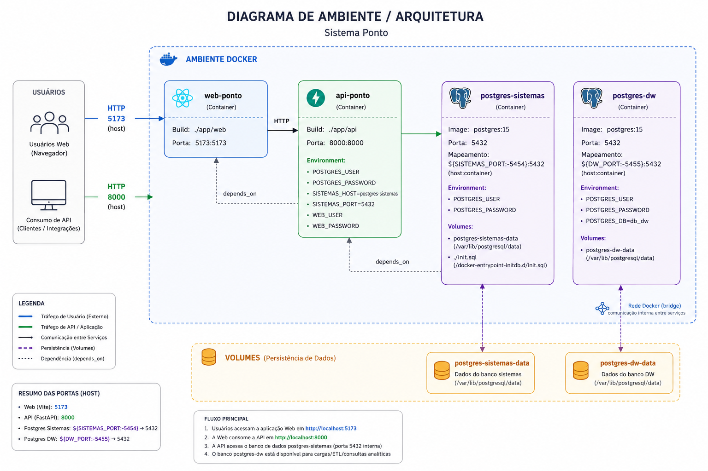

# Arquitetura do Sistema de Ponto Eletrônico (RH)

Este diretório (`app/`) contém o código-fonte de todo o ecossistema simulado de Ponto Eletrônico. O sistema é dividido em microsserviços rodando em containers Docker e é composto pelas seguintes partes:

## 1. Bancos de Dados (PostgreSQL)

Os dados são geridos por instâncias PostgreSQL orquestradas via `docker-compose`.

*   **Sistemas Transacionais (OLTP):**
    *   Um único container (`postgres-sistemas`) exposto na porta `5454`.
    *   Ele hospeda os dois bancos de dados simulados da empresa:
        *   `db_admin`: Guarda os apontamentos, férias e cadastros dos **Funcionários Administrativos e Estagiários**.
        *   `db_motoristas`: Guarda as informações exclusivas dos **Motoristas** da logística.
    *   *Nota: Ambas as bases compartilham um grupo comum de 3 empresas matrizes.*

*   **Data Warehouse (OLAP):**
    *   Container separado (`postgres-dw`) na porta `5455`.
    *   Possui a base `db_dw`. Esse banco está preparado para receber os modelos dimensionais criados futuramente pelo dbt (tabelas fato e dimensões analíticas).

## 2. Gerador de Dados Transacionais (`ponto-eletronico/`)

*   **Tecnologias:** Python (SQLAlchemy + Faker).
*   **Função:** Trata-se de um serviço temporário (`data-generator`) que é acionado automaticamente quando você sobe os containers. Ele se conecta às bases `db_admin` e `db_motoristas` e as popula com milhares de registros retroativos (de Jan/2020 a Jun/2026), simulando a realidade transacional do ponto (funcionários ativos, desligados, férias, horários de entrada/saída).

## 3. Backend da Aplicação (`api/`)

*   **Tecnologias:** Python, FastAPI.
*   **Função:** Exposto na porta `8000`, este serviço unifica a comunicação entre os dois sistemas de banco de dados e o frontend.
*   Sua lógica resolve automaticamente em qual banco buscar os dados dependendo da seleção feita pelo usuário, além de possuir paginação, filtros e rotas de agregação (dashboard/KPIs).

## 4. Frontend - Dashboard do Analista (`web/`)

*   **Tecnologias:** React, Vite, Vanilla CSS.
*   **Função:** Exposto na porta `5173`, é a interface gráfica onde o Analista de RH consulta os dados.
*   **Características:** Estética moderna (glassmorphism e temas escuros), contendo painéis consolidados, gráficos de barras, navegação lateral intuitiva e abas que mostram em detalhes o perfil do colaborador.

## Fluxo Resumido do Docker Compose

1.  Os dois containers de PostgreSQL (`sistemas` e `dw`) iniciam. O de `sistemas` roda um script (`init.sql`) criando os 2 bancos necessários.
2.  O serviço **`data-generator`** aguarda o banco ligar e então roda para encher as bases com os dados fake.
3.  O serviço **`api`** sobe e se conecta com o banco de `sistemas`.
4.  O serviço **`web`** sobe por último, conectando o browser à `api`.
