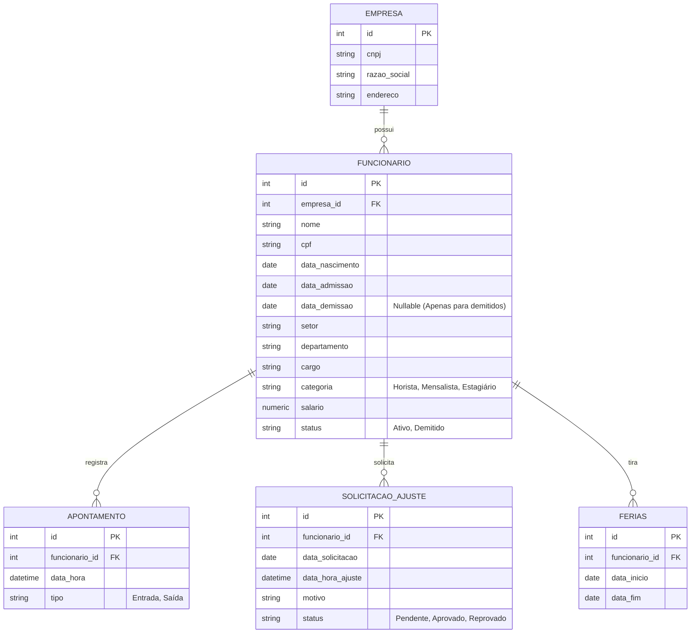

# Sistema de Ponto Eletrônico (Gerador de Dados Transacionais)

Este diretório contém o script responsável por simular e popular bases de dados transacionais de um sistema de controle de ponto eletrônico. O principal objetivo é fornecer uma massa de dados consistente e realista (variando de Janeiro de 2020 a Junho de 2026) que será utilizada posteriormente para a modelagem de um Data Warehouse (DW) utilizando `dbt`.

## Estrutura dos Sistemas

O ambiente simula dois sistemas independentes, separados por bancos de dados dentro da mesma instância do PostgreSQL:

1. **`db_admin`**: Sistema utilizado pelos funcionários da administração. Inclui colaboradores das categorias "Mensalista", "Horista" e "Estagiário". Possui diversos setores e departamentos administrativos.
2. **`db_motoristas`**: Sistema utilizado especificamente pelos motoristas da empresa (categoria "Mensalista" e "Horista"). Não possui estagiários. O setor e departamento são focados em Logística/Transporte.

Ambos os bancos compartilham a mesma estrutura de tabelas, o que facilita o processo de extração (ELT) para a consolidação no Data Warehouse (`db_dw`).

## Diagrama Entidade-Relacionamento (DER)

Abaixo está o modelo de dados presente em ambos os bancos (`db_admin` e `db_motoristas`):

## Como executar a geração de dados

A geração de dados utiliza SQLAlchemy Core (com inserções em lote para desempenho) e a biblioteca Faker. Para executar:

1. Certifique-se de que os containers do Docker estejam rodando (`docker compose up -d` na raiz do projeto).
2. Instale as dependências: `pip install -r requirements.txt`.
3. Execute o script: `python generate_data.py`.
